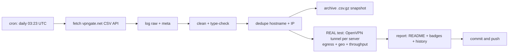

# 🛡️ VPN Gate Monitor

> **Daily** this repo fetches the complete public [VPN Gate](https://www.vpngate.net/en/) server list, **cleans, deduplicates and archives** it — and then does the part that matters: it **opens a real OpenVPN tunnel to every single listed server**, verifies that traffic genuinely exits through it, checks *where* it exits and **who operates that exit** (ISP, AS, IP reputation), and measures real download **and upload** throughput.
>
> **Everything below this line is the auto-generated living report. No hand-edited numbers.**

[](https://github.com/onlyactions/vpngate-monitor/actions/workflows/vpngate.yml)
[](https://raw.githubusercontent.com/onlyactions/vpngate-monitor/main/badges/servers.json)
[](https://raw.githubusercontent.com/onlyactions/vpngate-monitor/main/badges/alive.json)
[](https://raw.githubusercontent.com/onlyactions/vpngate-monitor/main/badges/speed.json)
[](https://raw.githubusercontent.com/onlyactions/vpngate-monitor/main/badges/up-speed.json)
[](https://raw.githubusercontent.com/onlyactions/vpngate-monitor/main/badges/clean.json)
[](https://raw.githubusercontent.com/onlyactions/vpngate-monitor/main/badges/updated.json)

## 📊 Latest results

| | |
|---|---|
| **Run** | [#21 · view run](https://github.com/onlyactions/vpngate-monitor/actions/runs/45416780173) · 2026-11-24 14:41:04 UTC · trigger: `push` |
| **Servers fetched (unique)** | **95** |
| **Duplicates removed** | 0 exact + 5 same-IP |
| **Servers tested** | **1,508 of 1,508** — all 95 current + 1,413 historical (every server seen in the API within 30 days) |
| **✅ Verified alive** (tunnel up + egress proven) | **550** — 63 from the current list + 487 historical ♻️ |
| **❌ Dead / unusable** | 958 |
| **Usability** | **66.3%** of everything VPN Gate lists right now actually works |
| **⚡ Measured download (avg / median / max)** | **14.6 / 16.0 / 38.0 Mbps** |
| **⚡ Measured upload (avg / max)** | **2.5 / 10.5 Mbps** |
| **🧼 Exit IP reputation** | **171** unflagged ('clean') · **547** residential · **8** mobile · rest datacenter/flagged |
| **🚀 Fastest verified** | **vpn167234104** · 🇯🇵 Japan · **38.0 Mbps** |
| **🧭 Exit-country mismatches** | 2 (server exits somewhere else than it claims) |
| **🤝 Handshake time (alive, avg)** | 3.0 s |

## 🚀 Fastest verified servers

Each row is fully described by its display name (see [How to read the names](#-how-to-read-the-names) below): country, ISP + AS of the **verified exit IP**, measured download/upload speed, the exit IP itself and its reputation.

```text
1. 🇯🇵 JP | Sony Network AS2527 | ↓38.0 ↑5.0Mbps | 39.111.221.149 | RES·Flag  (vpn167234104)
2. 🇯🇵 JP | Kddi AS2516 | ↓36.8 ↑4.9Mbps | 175.132.127.244 | RES·Flag  (vpn849985359)
3. 🇯🇵 JP | ASAHI Net AS4685 | ↓35.9 ↑4.8Mbps | 138.64.87.141 | RES·Flag  (vpn367633262)
4. 🇯🇵 JP | Sony Network AS2527 | ↓34.8 ↑4.6Mbps | 147.192.140.77 | RES·Flag  (vpn831230332)
5. 🇯🇵 JP | BIGLOBE AS2518 | ↓34.5 ↑4.5Mbps | 110.233.241.249 | RES·Clean  (vpn575184406)
6. 🇯🇵 JP | Sony Network AS2527 | ↓33.9 ↑3.7Mbps | 118.240.250.95 | RES·Flag  (vpn724833364)
7. 🇯🇵 JP | its communications AS9365 | ↓33.7 ↑4.9Mbps | 163.58.83.64 | RES·Flag  (vpn649976307)
8. 🇯🇵 JP | ASAHI Net AS4685 | ↓33.6 ↑4.4Mbps | 138.64.96.118 | RES·Flag  (vpn909153861)
9. 🇯🇵 JP | Sony Network AS2527 | ↓33.3 ↑4.4Mbps | 150.147.93.98 | RES·Clean  (vpn441877979)
10. 🇯🇵 JP | SoftBank AS17676 | ↓32.0 ↑4.2Mbps | 60.109.2.15 | RES·Flag  (vpn399531613)
```

| # | Server | Country | Endpoint | Exit IP (verified) | ISP · AS · rep | Measured ↓ | Measured ↑ | Claimed ↓ | Score |
|---:|---|---|---|---|---|---:|---:|---:|---:|
| 1 | `vpn167234104` | 🇯🇵 JP | `39.111.221.149:1195`/udp | `39.111.221.149` | Sony Network AS2527 RES·Flag | **38.0 Mbps** | 5.0 Mbps | 715.4 Mbps | 618,855 |
| 2 | `vpn849985359` | 🇯🇵 JP | `175.132.127.244:1783`/udp | `175.132.127.244` | Kddi AS2516 RES·Flag | **36.8 Mbps** | 4.9 Mbps | 166.1 Mbps | 668,829 |
| 3 | `vpn367633262` | 🇯🇵 JP | `138.64.87.141:39975`/udp | `138.64.87.141` | ASAHI Net AS4685 RES·Flag | **35.9 Mbps** | 4.8 Mbps | 665.7 Mbps | 670,751 |
| 4 | `vpn831230332` | 🇯🇵 JP | `147.192.140.77:1195`/udp | `147.192.140.77` | Sony Network AS2527 RES·Flag | **34.8 Mbps** | 4.6 Mbps | 957.6 Mbps | 702,065 |
| 5 | `vpn575184406` | 🇯🇵 JP | `110.233.241.249:1743`/udp | `110.233.241.249` | BIGLOBE AS2518 RES·Clean | **34.5 Mbps** | 4.5 Mbps | 653.2 Mbps | 739,620 |
| 6 | `vpn724833364` | 🇯🇵 JP | `118.240.250.95:1343`/udp | `118.240.250.95` | Sony Network AS2527 RES·Flag | **33.9 Mbps** | 3.7 Mbps | 148.1 Mbps | 1,442,397 |
| 7 | `vpn649976307` | 🇯🇵 JP | `163.58.83.64:1822`/udp | `163.58.83.64` | its communications AS9365 RES·Flag | **33.7 Mbps** | 4.9 Mbps | 319.8 Mbps | 586,080 |
| 8 | `vpn909153861` | 🇯🇵 JP | `138.64.96.118:14355`/udp | `138.64.96.118` | ASAHI Net AS4685 RES·Flag | **33.6 Mbps** | 4.4 Mbps | 185.0 Mbps | 663,610 |
| 9 | `vpn441877979` | 🇯🇵 JP | `150.147.93.98:1479`/udp | `150.147.93.98` | Sony Network AS2527 RES·Clean | **33.3 Mbps** | 4.4 Mbps | 488.6 Mbps | 865,079 |
| 10 | `vpn399531613` | 🇯🇵 JP | `60.109.2.15:1354`/udp | `60.109.2.15` | SoftBank AS17676 RES·Flag | **32.0 Mbps** | 4.2 Mbps | 368.1 Mbps | 612,995 |

*Measured = 5 MB download + 512 KB upload through the live tunnel to speed.cloudflare.com. Claimed = the server's self-reported line speed in the VPN Gate API. Exit IP/ISP/reputation are looked up from ip-api after the tunnels close. 'Historical' servers are no longer in the API's current top list but still answered our tunnel — we keep re-testing everything we have ever seen.*

## 🏷️ How to read the names

Every verified server gets a display name that tells you everything about **what you would actually connect to**:

```text
🇩🇪 DE | Contabo AS141995 | ↓12.0 ↑1.2Mbps | 84.247.155.196 | DC·Clean
```

| part | meaning |
|------|---------|
| `🇩🇪 DE` | country of the **verified exit** (not what the server claims) |
| `Contabo AS141995` | ISP / organization operating the exit IP and its autonomous system |
| `↓12.0 ↑1.2Mbps` | download / upload measured through the live tunnel (`?` = test failed) |
| `84.247.155.196` | the verified exit IP — your egress address |
| `DC` | datacenter / hosting IP (most VPN Gate servers) |
| `RES` | residential IP — usually the best bet against bot/VPN blocks |
| `MOB` | mobile / carrier IP (CGNAT) |
| `Clean` | exit not listed in ip-api's proxy/VPN/Tor database |
| `Flag` | exit listed as proxy/VPN — expect streaming blocks |

## ⭐ Top-scored & verified alive

| # | Server | Country | Score | Claimed ↓ | Measured ↓ | Measured ↑ | Sessions | Uptime | Log policy |
|---:|---|---|---:|---:|---:|---:|---:|---:|---|
| 1 | `public-vpn-261` | 🇯🇵 JP | 3,070,532 | 251.5 Mbps | 2.3 Mbps | 2.3 Mbps | 107 | 31.3 d | 2weeks |
| 2 | `public-vpn-100` | 🇯🇵 JP | 3,003,937 | 236.1 Mbps | 12.8 Mbps | 1.8 Mbps | 179 | 16.9 d | 2weeks |
| 3 | `public-vpn-229` | 🇯🇵 JP | 2,935,826 | 99.1 Mbps | 14.0 Mbps | 2.2 Mbps | 140 | 29.9 d | 2weeks |
| 4 | `public-vpn-258` | 🇯🇵 JP | 2,927,383 | 194.9 Mbps | 18.1 Mbps | 3.4 Mbps | 64 | 16.9 d | 2weeks |
| 5 | `public-vpn-0` | 🇯🇵 JP | 2,899,483 | 727.6 Mbps | 10.8 Mbps | 2.1 Mbps | 80 | 26.9 d | 2weeks |
| 6 | `public-vpn-126` | 🇯🇵 JP | 2,878,776 | 569.1 Mbps | 12.6 Mbps | 2.6 Mbps | 117 | 29.9 d | 2weeks |
| 7 | `public-vpn-71` | 🇯🇵 JP | 2,849,713 | 221.5 Mbps | 18.0 Mbps | 0.9 Mbps | 83 | 30.9 d | 2weeks |
| 8 | `public-vpn-202` | 🇯🇵 JP | 2,849,321 | 236.5 Mbps | 12.1 Mbps | 4.0 Mbps | 78 | 23.9 d | 2weeks |
| 9 | `public-vpn-52` | 🇯🇵 JP | 2,801,266 | 276.9 Mbps | 14.4 Mbps | 1.4 Mbps | 99 | 29.9 d | 2weeks |
| 10 | `public-vpn-39` | 🇯🇵 JP | 2,787,871 | 228.2 Mbps | 17.5 Mbps | 2.0 Mbps | 137 | 14.9 d | 2weeks |

## 🌍 Countries

| Country | Servers | Verified alive | Best measured ↓ | Fastest server |
|---|---:|---:|---:|---|
| 🇯🇵 Japan (JP) | 692 | 298 | 38.0 Mbps | `vpn167234104` |
| 🇰🇷 Korea Republic of (KR) | 498 | 203 | 31.1 Mbps | `vpn980553333` |
| 🇷🇺 Russian Federation (RU) | 122 | 19 | 15.4 Mbps | `vpn999198455` |
| 🇹🇭 Thailand (TH) | 59 | 9 | 20.8 Mbps | `vpn464019589` |
| 🇺🇸 United States (US) | 38 | 4 | 12.7 Mbps | `vpn309240574` |
| 🇻🇳 Viet Nam (VN) | 20 | 3 | 12.6 Mbps | `vpn962828858` |
| 🇦🇺 Australia (AU) | 8 | 0 | 0.0 Mbps | `` |
| 🇦🇷 Argentina (AR) | 5 | 0 | 0.0 Mbps | `` |
| 🇧🇷 Brazil (BR) | 5 | 0 | 0.0 Mbps | `` |
| 🇵🇪 Peru (PE) | 5 | 1 | 8.6 Mbps | `vpn378459626` |
| 🇨🇦 Canada (CA) | 4 | 1 | 17.8 Mbps | `vpn491348575` |
| 🇮🇩 Indonesia (ID) | 4 | 2 | 13.3 Mbps | `vpn104-cyberdewata` |
| 🇦🇪 United Arab Emirates (AE) | 3 | 1 | 9.1 Mbps | `wams` |
| 🇬🇧 United Kingdom (GB) | 3 | 0 | 0.0 Mbps | `` |
| 🇭🇷 Croatia (LOCAL Name: Hrvatska) (HR) | 3 | 1 | 0.8 Mbps | `vpn457795651` |
| 🇮🇳 India (IN) | 3 | 1 | 10.3 Mbps | `vpn359610091` |
| 🇲🇲 Myanmar (MM) | 3 | 0 | 0.0 Mbps | `` |
| 🇲🇽 Mexico (MX) | 3 | 1 | 7.0 Mbps | `cetsssa` |
| 🇧🇾 Belarus (BY) | 2 | 0 | 0.0 Mbps | `` |
| 🇨🇳 China (CN) | 2 | 0 | 0.0 Mbps | `` |
| 🇪🇨 Ecuador (EC) | 2 | 0 | 0.0 Mbps | `` |
| 🇭🇰 Hong Kong (HK) | 2 | 1 | 1.2 Mbps | `vpn942711940` |
| 🇲🇾 Malaysia (MY) | 2 | 0 | 0.0 Mbps | `` |
| 🇳🇿 New Zealand (NZ) | 2 | 1 | 26.2 Mbps | `vpn640114063` |
| 🇵🇦 Panama (PA) | 2 | 1 | 6.8 Mbps | `vpn743273359` |
| 🇵🇭 Philippines (PH) | 2 | 0 | 0.0 Mbps | `` |
| 🇹🇼 Taiwan (TW) | 2 | 1 | 1.1 Mbps | `vpn503500791` |
| 🇻🇪 Venezuela (VE) | 2 | 1 | 19.5 Mbps | `vpn589121690` |
| 🇨🇭 Switzerland (CH) | 1 | 0 | 0.0 Mbps | `` |
| 🇨🇴 Colombia (CO) | 1 | 0 | 0.0 Mbps | `` |
| 🇫🇷 France (FR) | 1 | 0 | 0.0 Mbps | `` |
| 🇬🇩 Grenada (GD) | 1 | 1 | 3.0 Mbps | `diamondgnd` |
| 🇮🇹 Italy (IT) | 1 | 0 | 0.0 Mbps | `` |
| 🇯🇴 Jordan (JO) | 1 | 0 | 0.0 Mbps | `` |
| 🇳🇱 Netherlands (NL) | 1 | 0 | 0.0 Mbps | `` |
| 🇵🇸 Palestinian Territory Occupied (PS) | 1 | 0 | 0.0 Mbps | `` |
| 🇵🇹 Portugal (PT) | 1 | 0 | 0.0 Mbps | `` |
| 🇷🇴 Romania (RO) | 1 | 0 | 0.0 Mbps | `` |

## 🕵️ Claim vs. reality

The VPN Gate `Speed` field is whatever the server *claims*. Here is the truth, measured through a live tunnel — the hall of shame (claimed ≫ delivered):

| Server | Country | Claims | Delivers | Reality ratio |
|---|---|---:|---:|---:|
| `vpn981288372` | 🇯🇵 JP | 237 Mbps | 0.1 Mbps | 0% |
| `vpn831105538` | 🇯🇵 JP | 434 Mbps | 0.2 Mbps | 0% |
| `vpn517964018` | 🇰🇷 KR | 87 Mbps | 0.1 Mbps | 0% |
| `vpn699620341` | 🇰🇷 KR | 334 Mbps | 0.5 Mbps | 0% |
| `vpn989011939` | 🇰🇷 KR | 38 Mbps | 0.1 Mbps | 0% |
| `vpn779820187` | 🇯🇵 JP | 621 Mbps | 1.7 Mbps | 0% |
| `vpn880633907` | 🇯🇵 JP | 692 Mbps | 2.2 Mbps | 0% |
| `vpn805797245` | 🇰🇷 KR | 448 Mbps | 1.5 Mbps | 0% |
| `vpn979052232` | 🇰🇷 KR | 486 Mbps | 1.7 Mbps | 0% |
| `public-vpn-142` | 🇯🇵 JP | 632 Mbps | 2.3 Mbps | 0% |

Most honest of this round: `vpn501671840` (19 Mbps), `vpn799057875` (19 Mbps), `vpn408435278` (20 Mbps), `vpn151821463` (19 Mbps), `vpn434117392` (11 Mbps).

## 🧭 Exit-country mismatches

These servers are listed under one country but your traffic **actually exits somewhere else** (verified via Cloudflare's geo view of the exit IP) — useful to know before you trust one:

| Server | Claims | Actually exits via | Exit IP | Measured ↓ |
|---|---|---|---|---:|
| `vpn127728667` | 🇷🇺 RU | 🇺🇦 UA | `109.110.90.244` | 3.3 Mbps |
| `vpn457795651` | 🇭🇷 HR | 🇧🇬 BG | `150.40.105.20` | 0.8 Mbps |

## 📈 History

Alive % trend (last 31 runs): `██▇▆▆▁▄▅▄▃▄█▄▄▄▄▄▄▃▃▃▃▃▂▃▂▂▂▂▁▂`

Avg measured speed (Mbps): `▄▅▁▅▁▆▅▄▁▃▁▄▃▄▄▅▅██▄▅█▃▇▄▂▅▅▆▅▆`

| Run at | Fetched | Alive | Alive % | Avg ↓ | Max ↓ | Avg ↑ | Mismatches |
|---|---:|---:|---:|---:|---:|---:|---:|
| 2026-11-24 14:29:24 UTC | 94 | 505 | 35% | 13.2 | 31.7 | 0.0 | 1 |
| 2026-11-24 04:29:47 UTC | 87 | 452 | 33% | 12.1 | 39.7 | 0.0 | 1 |
| 2026-11-23 04:37:36 UTC | 92 | 479 | 36% | 13.3 | 39.2 | 0.0 | 2 |
| 2026-11-22 04:22:09 UTC | 95 | 445 | 35% | 12.3 | 35.6 | 0.0 | 2 |
| 2026-11-21 04:18:18 UTC | 93 | 435 | 36% | 12.0 | 28.8 | 0.0 | 2 |
| 2026-11-20 04:21:47 UTC | 93 | 436 | 38% | 9.8 | 39.0 | 0.0 | 2 |
| 2026-11-19 04:25:57 UTC | 95 | 429 | 40% | 11.4 | 47.3 | 0.0 | 3 |
| 2026-11-18 04:22:25 UTC | 92 | 389 | 39% | 14.2 | 37.8 | 0.0 | 2 |
| 2026-11-17 04:21:05 UTC | 98 | 397 | 42% | 11.0 | 26.6 | 0.0 | 3 |
| 2026-11-16 04:58:07 UTC | 94 | 366 | 42% | 14.3 | 35.9 | 0.0 | 1 |
| 2026-11-15 04:20:41 UTC | 90 | 334 | 41% | 12.4 | 29.8 | 0.0 | 0 |
| 2026-11-14 04:17:29 UTC | 98 | 323 | 44% | 11.3 | 54.8 | 0.0 | 2 |
| 2026-11-13 04:22:35 UTC | 97 | 295 | 44% | 14.9 | 46.8 | 0.0 | 1 |
| 2026-11-12 04:23:10 UTC | 93 | 272 | 46% | 15.0 | 29.9 | 0.0 | 0 |
| 2026-11-11 04:22:55 UTC | 97 | 234 | 45% | 12.0 | 28.2 | 0.0 | 0 |

## ⚙️ How the pipeline works


```mermaid
flowchart LR
    C["cron: daily 03:23 UTC"] --> F["fetch vpngate.net CSV API"]
    F --> L["log raw + meta"]
    L --> CL["clean + type-check"]
    CL --> D["dedupe hostname + IP"]
    D --> A["archive .csv.gz snapshot"]
    D --> T["REAL test: OpenVPN tunnel per server<br/>egress + geo + throughput"]
    T --> R["report: README + badges + history"]
    R --> P["commit and push"]
```

1. **Fetch** — `GET /api/iphone/` with retries and endpoint fallback; responses are validated (the API sometimes serves an empty placeholder page to datacenter IPs) and the raw bytes are logged and hashed (sha256).
2. **Clean** — parse the special CSV (`*vpn_servers` marker, `#`-prefixed header), type-check every numeric field, validate IPs, drop broken rows, strip noise.
3. **Dedupe** — remove exact `(HostName, IP)` duplicates, then same-IP entries keeping the highest-scoring one.
4. **Archive** — every run writes an immutable gzipped snapshot to `archive/` (auto-pruned to the newest 360 ≈ 90 days).
5. **Test — the real deal.** For **every** server, every run — not just the API's current list, but **the union of every server that has ever appeared** within the 30-day recall window (kept in `data/known_servers.json`): decode the shared VPN Gate OpenVPN template (all servers ship the same CA + dummy client cert — verified), rebuild each server's config with its remembered `(proto, port)`, force it onto a per-worker `tun` device, disable pushed routes, pin two /32 routes through the tunnel to per-worker Cloudflare anycast IPs, wait for *Initialization Sequence Completed*, then verify egress (`cdn-cgi/trace` through the tunnel must return a foreign exit IP + real exit country), measure a 5 MB download and a 512 KB upload through the same tunnel, and — once all tunnels are down — batch-lookup every verified exit IP at ip-api to add the ISP, AS and IP-reputation flags (datacenter / residential / mobile / proxy-DB) that you see in the display names. Up to 48 isolated tunnels run in parallel; a server that never completes the handshake is hard-killed after 25 s.
6. **Report** — this README, six live badges, `latest.json`, `summary.json` and the `history.jsonl` log are regenerated and committed by `github-actions[bot]`.

## 📁 Data files & programmatic use

All results are in this repo — hotlink them straight from `https://github.com/onlyactions/vpngate-monitor`:

- [`data/latest.json`](https://raw.githubusercontent.com/onlyactions/vpngate-monitor/main/data/latest.json) — the merged dataset: every cleaned server + its latest real test result
- [`data/servers_clean.csv`](https://raw.githubusercontent.com/onlyactions/vpngate-monitor/main/data/servers_clean.csv) — cleaned, deduplicated server list (no bulky config blobs)
- [`data/summary.json`](https://raw.githubusercontent.com/onlyactions/vpngate-monitor/main/data/summary.json) — compact run summary with failure breakdown
- [`data/history.jsonl`](https://raw.githubusercontent.com/onlyactions/vpngate-monitor/main/data/history.jsonl) — one JSON line per run, append-only
- [`archive/`](https://github.com/onlyactions/vpngate-monitor/tree/main/archive) — immutable gzipped snapshots of every run
- full logs, raw API response and per-server error details are attached to each [Actions run](https://github.com/onlyactions/vpngate-monitor/actions) as artifacts (30-day retention)

Grab a working VPN right now:

```bash
curl -s https://raw.githubusercontent.com/onlyactions/vpngate-monitor/main/data/latest.json \
  | python3 -c "import json,sys;[print(s['IP'],s['CountryShort'],s['test']['download_mbps'],'Mbps') for s in json.load(sys.stdin) if s['test'] and s['test']['alive']]" \
  | sort -k3 -nr | head
```

Field units: `Score` points · `Ping` ms · `Speed` bit/s (self-reported) · `Uptime` ms · `TotalUsers` count · `TotalTraffic` bytes · `download_mbps` / `upload_mbps` Mbps (measured through the tunnel) · `exit_*` = ISP/AS/city/reputation of the verified exit IP · `display_name` = the full-descriptor name.

## 🔬 Methodology & caveats

- **Real tunnels, not CSV checks.** A server only counts as alive if OpenVPN completed its handshake *and* an HTTPS request bound to the tunnel egressed with a foreign IP. A server whose tunnel silently black-holes traffic fails the egress step and is reported dead.
- **No DNS through the VPN.** Test destinations are pinned with `curl --resolve` to per-worker Cloudflare anycast addresses, so a broken/hijacking VPN DNS can never fake a success.
- **Throughput** is one 5 MB download plus one 512 KB upload to `speed.cloudflare.com` through the live tunnel — a sample, not a lab measurement.
- **Vantage point**: GitHub Actions runners (Azure, usually US/EU). A server that is slow from there may be fast from your country, and vice versa.
- **Fairness**: volunteer servers are shared — measured speeds dip when many clients are connected (`NumVpnSessions` is listed).
- **Security**: test traffic is TLS to Cloudflare only; we never send anything sensitive through volunteer servers. Neither should you — assume the operator can see traffic metadata.

## ⚠️ Disclaimer

- [VPN Gate](https://www.vpngate.net/en/) is an academic experiment by the University of Tsukuba, Japan (Daiyuu Nobori & co). This project is an independent monitor of its public API and is **not affiliated** with it.
- VPN servers are run by volunteers; some keep connection logs (see `LogType`). Use them legally and responsibly; do not route anything private or illegal through them.
- Data is provided **as-is** for research/educational purposes.

## 📄 License

Code: MIT. Data: originates from VPN Gate's public API — respect their terms.

---
*Auto-generated by [run #21](https://github.com/onlyactions/vpngate-monitor/actions/runs/45416780173) at 2026-11-24 14:51:16 UTC. Next scheduled run: daily 03:23 UTC.*
