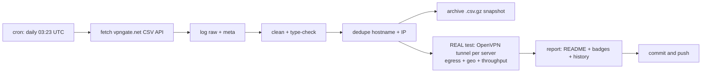

# 🛡️ VPN Gate Monitor

> **Once a day** this repo fetches the complete public [VPN Gate](https://www.vpngate.net/en/) server list, **cleans, deduplicates and archives** it — and then does the part that matters: it **opens a real OpenVPN tunnel to every single listed server**, verifies that traffic genuinely exits through it, checks *where* it exits, and measures real download throughput.
>
> **Everything below this line is the auto-generated living report. No hand-edited numbers.**

[](https://github.com/onlyactions/vpngate-monitor/actions/workflows/vpngate.yml)
[](https://raw.githubusercontent.com/onlyactions/vpngate-monitor/main/badges/servers.json)
[](https://raw.githubusercontent.com/onlyactions/vpngate-monitor/main/badges/alive.json)
[](https://raw.githubusercontent.com/onlyactions/vpngate-monitor/main/badges/speed.json)
[](https://raw.githubusercontent.com/onlyactions/vpngate-monitor/main/badges/updated.json)

## 📊 Latest results

| | |
|---|---|
| **Run** | [#19 · view run](https://github.com/onlyactions/vpngate-monitor/actions/runs/45326455346) · 2026-11-24 04:29:47 UTC · trigger: `schedule` |
| **Servers fetched (unique)** | **87** |
| **Duplicates removed** | 0 exact + 0 same-IP |
| **Servers tested** | **1,383 of 1,383** — all 87 current + 1,296 historical (every server seen in the API within 30 days) |
| **✅ Verified alive** (tunnel up + egress proven) | **452** — 36 from the current list + 416 historical ♻️ |
| **❌ Dead / unusable** | 931 |
| **Usability** | **41.4%** of everything VPN Gate lists right now actually works |
| **⚡ Measured speed (avg / median / max)** | **12.1 / 13.3 / 39.7 Mbps** |
| **🚀 Fastest verified** | **vpn491348575** · 🇨🇦 Canada · **39.7 Mbps** |
| **🧭 Exit-country mismatches** | 1 (server exits somewhere else than it claims) |
| **🤝 Handshake time (alive, avg)** | 2.8 s |

## 🚀 Fastest verified servers

| # | Server | Country | List | Endpoint | Handshake | Measured ↓ | Claimed ↓ | Score |
|---:|---|---|---|---|---:|---:|---:|---:|
| 1 | `vpn491348575` | 🇨🇦 Canada | ♻️ historical | `184.68.30.116:1697`/tcp | 1.5s | **39.7 Mbps** | 17.4 Mbps | 1,154,690 |
| 2 | `vpn156777673` | 🇲🇽 Mexico | ♻️ historical | `189.217.22.155:1195`/udp | 2.0s | **30.9 Mbps** | 80.0 Mbps | 602,013 |
| 3 | `vpn189019752` | 🇯🇵 Japan | ♻️ historical | `131.147.36.66:1195`/udp | 1.8s | **29.2 Mbps** | 932.1 Mbps | 610,142 |
| 4 | `vpn679218486` | 🇯🇵 Japan | ♻️ historical | `124.209.226.195:1752`/udp | 2.5s | **29.0 Mbps** | 682.8 Mbps | 683,399 |
| 5 | `vpn167234104` | 🇯🇵 Japan | ♻️ historical | `39.111.221.149:1195`/udp | 2.0s | **28.1 Mbps** | 715.4 Mbps | 618,855 |
| 6 | `vpn316528831` | 🇰🇷 Korea Republic of | ♻️ historical | `183.104.124.77:1949`/udp | 1.8s | **27.2 Mbps** | 47.6 Mbps | 634,448 |
| 7 | `vpn831230332` | 🇯🇵 Japan | ♻️ historical | `147.192.140.77:1195`/udp | 1.8s | **27.0 Mbps** | 957.6 Mbps | 702,065 |
| 8 | `vpn909153861` | 🇯🇵 Japan | ♻️ historical | `138.64.96.118:14355`/udp | 2.0s | **27.0 Mbps** | 185.0 Mbps | 663,610 |
| 9 | `vpn537511968` | 🇯🇵 Japan | ♻️ historical | `133.32.133.240:7610`/udp | 2.0s | **26.7 Mbps** | 529.5 Mbps | 618,402 |
| 10 | `vpn980553333` | 🇰🇷 Korea Republic of | 📋 current | `220.125.128.62:1959`/udp | 2.5s | **26.6 Mbps** | 99.9 Mbps | 667,111 |

*Measured = 5 MB download through the live tunnel to speed.cloudflare.com. Claimed = the server's self-reported line speed in the VPN Gate API. 'Historical' servers are no longer in the API's current top list but still answered our tunnel — we keep re-testing everything we have ever seen.*

## ⭐ Top-scored & verified alive

| # | Server | Country | Score | Claimed ↓ | Measured ↓ | Sessions | Uptime | Log policy |
|---:|---|---|---:|---:|---:|---:|---:|---|
| 1 | `public-vpn-71` | 🇯🇵 JP | 2,849,713 | 221.5 Mbps | 12.4 Mbps | 83 | 30.9 d | 2weeks |
| 2 | `public-vpn-206` | 🇯🇵 JP | 2,825,566 | 328.0 Mbps | 13.3 Mbps | 70 | 20.9 d | 2weeks |
| 3 | `public-vpn-52` | 🇯🇵 JP | 2,801,266 | 276.9 Mbps | 13.4 Mbps | 99 | 29.9 d | 2weeks |
| 4 | `public-vpn-185` | 🇯🇵 JP | 2,797,762 | 272.0 Mbps | 11.8 Mbps | 124 | 30.9 d | 2weeks |
| 5 | `public-vpn-39` | 🇯🇵 JP | 2,787,871 | 228.2 Mbps | 4.9 Mbps | 137 | 14.9 d | 2weeks |
| 6 | `public-vpn-95` | 🇯🇵 JP | 2,779,114 | 1,163.6 Mbps | 16.8 Mbps | 256 | 24.9 d | 2weeks |
| 7 | `public-vpn-251` | 🇯🇵 JP | 2,776,080 | 101.8 Mbps | 3.9 Mbps | 92 | 23.9 d | 2weeks |
| 8 | `public-vpn-164` | 🇯🇵 JP | 2,732,238 | 201.4 Mbps | 16.2 Mbps | 93 | 20.9 d | 2weeks |
| 9 | `public-vpn-259` | 🇯🇵 JP | 2,729,146 | 206.0 Mbps | 15.9 Mbps | 99 | 22.9 d | 2weeks |
| 10 | `vpn197493440` | 🇺🇸 US | 2,726,528 | 487.7 Mbps | 21.2 Mbps | 99 | 2.5 d | 2weeks |

## 🌍 Countries

| Country | Servers | Verified alive | Best measured ↓ | Fastest server |
|---|---:|---:|---:|---|
| 🇯🇵 Japan (JP) | 645 | 220 | 29.2 Mbps | `vpn189019752` |
| 🇰🇷 Korea Republic of (KR) | 449 | 198 | 27.2 Mbps | `vpn316528831` |
| 🇷🇺 Russian Federation (RU) | 107 | 7 | 17.0 Mbps | `vpn908098700` |
| 🇹🇭 Thailand (TH) | 53 | 4 | 17.0 Mbps | `vpn527493944` |
| 🇺🇸 United States (US) | 36 | 11 | 21.2 Mbps | `vpn197493440` |
| 🇻🇳 Viet Nam (VN) | 18 | 0 | 0.0 Mbps | `` |
| 🇦🇺 Australia (AU) | 7 | 1 | 12.8 Mbps | `vpn863521180` |
| 🇦🇷 Argentina (AR) | 5 | 0 | 0.0 Mbps | `` |
| 🇧🇷 Brazil (BR) | 5 | 0 | 0.0 Mbps | `` |
| 🇵🇪 Peru (PE) | 5 | 0 | 0.0 Mbps | `` |
| 🇮🇩 Indonesia (ID) | 4 | 2 | 11.0 Mbps | `vpn104-cyberdewata` |
| 🇦🇪 United Arab Emirates (AE) | 3 | 0 | 0.0 Mbps | `` |
| 🇨🇦 Canada (CA) | 3 | 2 | 39.7 Mbps | `vpn491348575` |
| 🇬🇧 United Kingdom (GB) | 3 | 0 | 0.0 Mbps | `` |
| 🇭🇷 Croatia (LOCAL Name: Hrvatska) (HR) | 3 | 0 | 0.0 Mbps | `` |
| 🇮🇳 India (IN) | 3 | 0 | 0.0 Mbps | `` |
| 🇲🇲 Myanmar (MM) | 3 | 0 | 0.0 Mbps | `` |
| 🇲🇽 Mexico (MX) | 3 | 1 | 30.9 Mbps | `vpn156777673` |
| 🇧🇾 Belarus (BY) | 2 | 0 | 0.0 Mbps | `` |
| 🇨🇳 China (CN) | 2 | 0 | 0.0 Mbps | `` |
| 🇪🇨 Ecuador (EC) | 2 | 1 | 22.2 Mbps | `vpn800617869` |
| 🇭🇰 Hong Kong (HK) | 2 | 1 | 0.8 Mbps | `vpn942711940` |
| 🇲🇾 Malaysia (MY) | 2 | 0 | 0.0 Mbps | `` |
| 🇳🇿 New Zealand (NZ) | 2 | 1 | 23.0 Mbps | `vpn640114063` |
| 🇵🇦 Panama (PA) | 2 | 0 | 0.0 Mbps | `` |
| 🇵🇭 Philippines (PH) | 2 | 0 | 0.0 Mbps | `` |
| 🇹🇼 Taiwan (TW) | 2 | 1 | 0.9 Mbps | `vpn503500791` |
| 🇨🇴 Colombia (CO) | 1 | 0 | 0.0 Mbps | `` |
| 🇫🇷 France (FR) | 1 | 0 | 0.0 Mbps | `` |
| 🇬🇩 Grenada (GD) | 1 | 0 | 0.0 Mbps | `` |
| 🇮🇹 Italy (IT) | 1 | 0 | 0.0 Mbps | `` |
| 🇯🇴 Jordan (JO) | 1 | 0 | 0.0 Mbps | `` |
| 🇳🇱 Netherlands (NL) | 1 | 0 | 0.0 Mbps | `` |
| 🇵🇸 Palestinian Territory Occupied (PS) | 1 | 0 | 0.0 Mbps | `` |
| 🇵🇹 Portugal (PT) | 1 | 0 | 0.0 Mbps | `` |
| 🇷🇴 Romania (RO) | 1 | 1 | 13.3 Mbps | `opengw` |
| 🇻🇪 Venezuela (VE) | 1 | 1 | 5.2 Mbps | `vpn589121690` |

## 🕵️ Claim vs. reality

The VPN Gate `Speed` field is whatever the server *claims*. Here is the truth, measured through a live tunnel — the hall of shame (claimed ≫ delivered):

| Server | Country | Claims | Delivers | Reality ratio |
|---|---|---:|---:|---:|
| `vpn981288372` | 🇯🇵 JP | 237 Mbps | 0.1 Mbps | 0% |
| `vpn699620341` | 🇰🇷 KR | 334 Mbps | 0.5 Mbps | 0% |
| `vpn716109838` | 🇰🇷 KR | 772 Mbps | 1.2 Mbps | 0% |
| `vpn165692380` | 🇰🇷 KR | 80 Mbps | 0.1 Mbps | 0% |
| `vpn805797245` | 🇰🇷 KR | 448 Mbps | 1.1 Mbps | 0% |
| `public-vpn-68` | 🇯🇵 JP | 582 Mbps | 1.6 Mbps | 0% |
| `vpn750706241` | 🇯🇵 JP | 332 Mbps | 0.9 Mbps | 0% |
| `vpn400535836` | 🇯🇵 JP | 1,116 Mbps | 3.3 Mbps | 0% |
| `vpn588948343` | 🇰🇷 KR | 413 Mbps | 1.5 Mbps | 0% |
| `public-vpn-182` | 🇯🇵 JP | 632 Mbps | 2.3 Mbps | 0% |

Most honest of this round: `vpn491348575` (40 Mbps), `vpn244093263` (17 Mbps), `vpn151821463` (17 Mbps), `vpn434117392` (12 Mbps), `vpn408435278` (15 Mbps).

## 🧭 Exit-country mismatches

These servers are listed under one country but your traffic **actually exits somewhere else** (verified via Cloudflare's geo view of the exit IP) — useful to know before you trust one:

| Server | Claims | Actually exits via | Exit IP | Measured ↓ |
|---|---|---|---|---:|
| `opengw` | 🇷🇴 RO | 🇯🇵 JP | `187.15.135.101` | 13.3 Mbps |

## 📈 History

Alive % trend (last 29 runs): `██▇▆▆▁▄▅▄▃▄█▄▄▄▄▄▄▃▃▃▃▃▂▃▂▂▂▂`

Avg measured speed (Mbps): `▄▅▁▅▁▆▅▄▁▃▁▄▃▄▄▅▅██▄▅█▃▇▄▂▅▅▆`

| Run at | Fetched | Alive | Alive % | Avg ↓ | Max ↓ | Mismatches |
|---|---:|---:|---:|---:|---:|---:|
| 2026-11-23 04:37:36 UTC | 92 | 479 | 36% | 13.3 | 39.2 | 2 |
| 2026-11-22 04:22:09 UTC | 95 | 445 | 35% | 12.3 | 35.6 | 2 |
| 2026-11-21 04:18:18 UTC | 93 | 435 | 36% | 12.0 | 28.8 | 2 |
| 2026-11-20 04:21:47 UTC | 93 | 436 | 38% | 9.8 | 39.0 | 2 |
| 2026-11-19 04:25:57 UTC | 95 | 429 | 40% | 11.4 | 47.3 | 3 |
| 2026-11-18 04:22:25 UTC | 92 | 389 | 39% | 14.2 | 37.8 | 2 |
| 2026-11-17 04:21:05 UTC | 98 | 397 | 42% | 11.0 | 26.6 | 3 |
| 2026-11-16 04:58:07 UTC | 94 | 366 | 42% | 14.3 | 35.9 | 1 |
| 2026-11-15 04:20:41 UTC | 90 | 334 | 41% | 12.4 | 29.8 | 0 |
| 2026-11-14 04:17:29 UTC | 98 | 323 | 44% | 11.3 | 54.8 | 2 |
| 2026-11-13 04:22:35 UTC | 97 | 295 | 44% | 14.9 | 46.8 | 1 |
| 2026-11-12 04:23:10 UTC | 93 | 272 | 46% | 15.0 | 29.9 | 0 |
| 2026-11-11 04:22:55 UTC | 97 | 234 | 45% | 12.0 | 28.2 | 0 |
| 2026-11-10 04:16:47 UTC | 95 | 205 | 46% | 12.6 | 65.4 | 1 |
| 2026-11-09 04:26:43 UTC | 93 | 164 | 45% | 11.4 | 39.3 | 0 |

## ⚙️ How the pipeline works


```mermaid
flowchart LR
    C["cron: daily 03:23 UTC"] --> F["fetch vpngate.net CSV API"]
    F --> L["log raw + meta"]
    L --> CL["clean + type-check"]
    CL --> D["dedupe hostname + IP"]
    D --> A["archive .csv.gz snapshot"]
    D --> T["REAL test: OpenVPN tunnel per server<br/>egress + geo + throughput"]
    T --> R["report: README + badges + history"]
    R --> P["commit and push"]
```

1. **Fetch** — `GET /api/iphone/` with retries and endpoint fallback; responses are validated (the API sometimes serves an empty placeholder page to datacenter IPs) and the raw bytes are logged and hashed (sha256).
2. **Clean** — parse the special CSV (`*vpn_servers` marker, `#`-prefixed header), type-check every numeric field, validate IPs, drop broken rows, strip noise.
3. **Dedupe** — remove exact `(HostName, IP)` duplicates, then same-IP entries keeping the highest-scoring one.
4. **Archive** — every run writes an immutable gzipped snapshot to `archive/` (auto-pruned to the newest 360 ≈ 90 days).
5. **Test — the real deal.** For **every** server, every run — not just the API's current list, but **the union of every server that has ever appeared** within the 30-day recall window (kept in `data/known_servers.json`): decode the shared VPN Gate OpenVPN template (all servers ship the same CA + dummy client cert — verified), rebuild each server's config with its remembered `(proto, port)`, force it onto a per-worker `tun` device, disable pushed routes, pin two /32 routes through the tunnel to per-worker Cloudflare anycast IPs, wait for *Initialization Sequence Completed*, then verify egress (`cdn-cgi/trace` through the tunnel must return a foreign exit IP + real exit country) and measure a 5 MB download through the same tunnel. Up to 48 isolated tunnels run in parallel; a server that never completes the handshake is hard-killed after 25 s.
6. **Report** — this README, four live badges, `latest.json`, `summary.json` and the `history.jsonl` log are regenerated and committed by `github-actions[bot]`.

## 📁 Data files & programmatic use

All results are in this repo — hotlink them straight from `https://github.com/onlyactions/vpngate-monitor`:

- [`data/latest.json`](https://raw.githubusercontent.com/onlyactions/vpngate-monitor/main/data/latest.json) — the merged dataset: every cleaned server + its latest real test result
- [`data/servers_clean.csv`](https://raw.githubusercontent.com/onlyactions/vpngate-monitor/main/data/servers_clean.csv) — cleaned, deduplicated server list (no bulky config blobs)
- [`data/summary.json`](https://raw.githubusercontent.com/onlyactions/vpngate-monitor/main/data/summary.json) — compact run summary with failure breakdown
- [`data/history.jsonl`](https://raw.githubusercontent.com/onlyactions/vpngate-monitor/main/data/history.jsonl) — one JSON line per run, append-only
- [`archive/`](https://github.com/onlyactions/vpngate-monitor/tree/main/archive) — immutable gzipped snapshots of every run
- full logs, raw API response and per-server error details are attached to each [Actions run](https://github.com/onlyactions/vpngate-monitor/actions) as artifacts (30-day retention)

Grab a working VPN right now:

```bash
curl -s https://raw.githubusercontent.com/onlyactions/vpngate-monitor/main/data/latest.json \
  | python3 -c "import json,sys;[print(s['IP'],s['CountryShort'],s['test']['download_mbps'],'Mbps') for s in json.load(sys.stdin) if s['test'] and s['test']['alive']]" \
  | sort -k3 -nr | head
```

Field units: `Score` points · `Ping` ms · `Speed` bit/s (self-reported) · `Uptime` ms · `TotalUsers` count · `TotalTraffic` bytes · `download_mbps` Mbps (measured through the tunnel).

## 🔬 Methodology & caveats

- **Real tunnels, not CSV checks.** A server only counts as alive if OpenVPN completed its handshake *and* an HTTPS request bound to the tunnel egressed with a foreign IP. A server whose tunnel silently black-holes traffic fails the egress step and is reported dead.
- **No DNS through the VPN.** Test destinations are pinned with `curl --resolve` to per-worker Cloudflare anycast addresses, so a broken/hijacking VPN DNS can never fake a success.
- **Throughput** is one 5 MB download to `speed.cloudflare.com` through the live tunnel — a sample, not a lab measurement.
- **Vantage point**: GitHub Actions runners (Azure, usually US/EU). A server that is slow from there may be fast from your country, and vice versa.
- **Fairness**: volunteer servers are shared — measured speeds dip when many clients are connected (`NumVpnSessions` is listed).
- **Security**: test traffic is TLS to Cloudflare only; we never send anything sensitive through volunteer servers. Neither should you — assume the operator can see traffic metadata.

## ⚠️ Disclaimer

- [VPN Gate](https://www.vpngate.net/en/) is an academic experiment by the University of Tsukuba, Japan (Daiyuu Nobori & co). This project is an independent monitor of its public API and is **not affiliated** with it.
- VPN servers are run by volunteers; some keep connection logs (see `LogType`). Use them legally and responsibly; do not route anything private or illegal through them.
- Data is provided **as-is** for research/educational purposes.

## 📄 License

Code: MIT. Data: originates from VPN Gate's public API — respect their terms.

---
*Auto-generated by [run #19](https://github.com/onlyactions/vpngate-monitor/actions/runs/45326455346) at 2026-11-24 04:38:34 UTC. Next scheduled run: daily at 03:23 UTC.*
